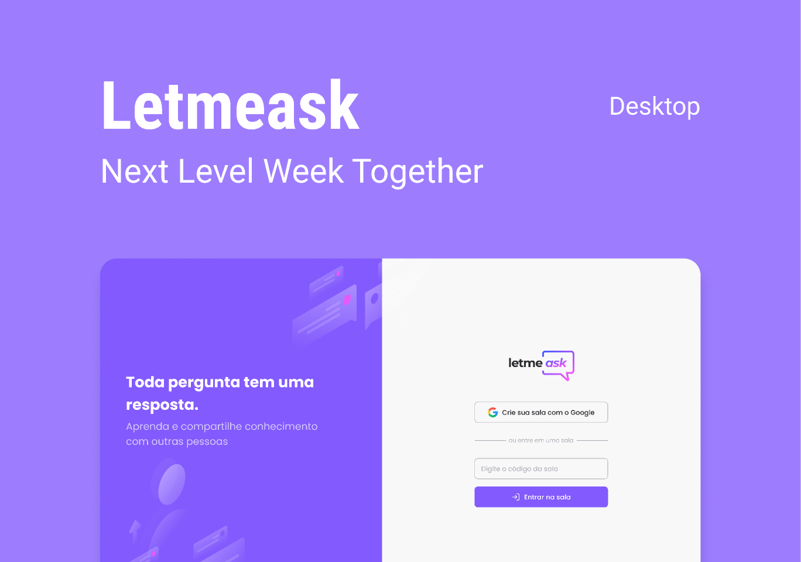
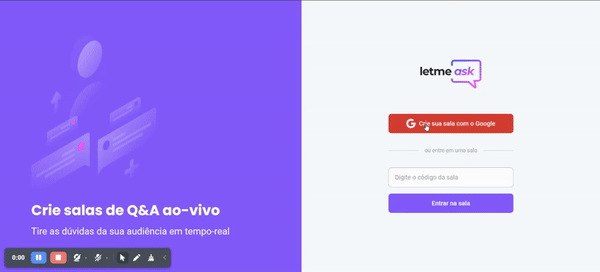

# Projeto LetMeAsk 💬
LetMeAsk é uma aplicação desenvolvida em ReactJS com integração direta ao Firebase, que permite aos participantes criar salas de perguntas e respostas usando suas contas do Google.


[LINK DO FIGMA](https://www.figma.com/community/file/1009824839797878169)


## Preview da Aplicação  👨‍🎨



## Funcionalidades 👨‍💼

✅ **Criação de sala:** Os participantes podem criar uma sala utilizando suas contas do Google, proporcionando um processo rápido e seguro de login e autenticação.<br/>
✅ **Tipos de Sala:** 
- **Admin:** Acesso exclusivo para o palestrante ou administrador, onde é possível gerenciar as perguntas recebidas.
- **Participante:** Espaço onde os usuários podem enviar suas perguntas e interagir com perguntas de outros participantes.<br/>
✅ **Interações com Perguntas:**
- **Envio de Perguntas:** Usuários logados podem enviar perguntas relacionadas ao tema da sala.
- **Likes nas Perguntas:** Perguntas podem receber likes de outros participantes, destacando as mais relevantes ou interessantes.
- **Visualização:** Usuários não logados podem visualizar todas as perguntas e interações, mas não podem enviar perguntas.<br/>
✅ **Gestão de Perguntas pelo Admin:**
- **Dar Destaque:** O palestrante pode selecionar e destacar perguntas importantes.
- **Marcar como Respondida:** Permite ao palestrante marcar perguntas que já foram respondidas.
- **Deletar Perguntas:** O palestrante pode deletar perguntas inapropriadas ou repetitivas, mantendo a qualidade da discussão.<br/>
✅ **Encerramento de Sala:** Ao final da sessão, o palestrante pode encerrar a sala, e qualquer tentativa de acesso subsequente notificará os usuários de que a sala já foi encerrada.<br/>

## Cenários

✅ **Exibição de perguntas e interações:**
- Visualização das perguntas enviadas por outros participantes.
- Interação com perguntas via likes.<br/>
✅ **Envio e gestão de perguntas:**
- Envio de perguntas para a sala quando logado.
- Destaque, marcação como respondida e deleção de perguntas pelo admin.<br/>
✅ **Encerramento de sala:** 
- Encerramento da sala pelo palestrante.
- Notificação de sala encerrada ao tentar acessar uma sala já encerrada.<br/>

## Como rodar o projeto 🚀
Faça download do .ZIP da aplicação ou clone o repositório e instale as dependências <br/>

```bash
npm install # para instalar as dependências
npm run dev # para rodar a aplicação web

```

Lembre-se de criar uma conta no **Firebase** da Google e use o arquivo *.env.template* como base para suas variáveis:

```bash
REACT_APP_API_KEY=your_actual_api_key
REACT_APP_AUTH_DOMAIN=your_actual_auth_domain
REACT_APP_PROJECT_ID=your_actual_project_id
REACT_APP_STORAGE_BUCKET=your_actual_storage_bucket
REACT_APP_MESSAGING_SENDER_ID=your_actual_messaging_sender_id
REACT_APP_APP_ID=your_actual_app_id

```
